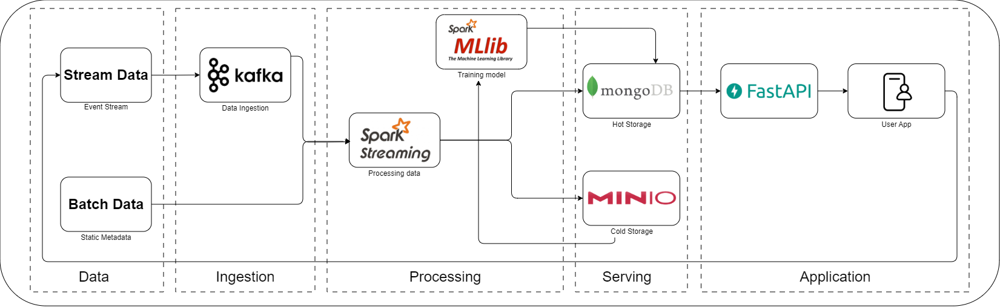
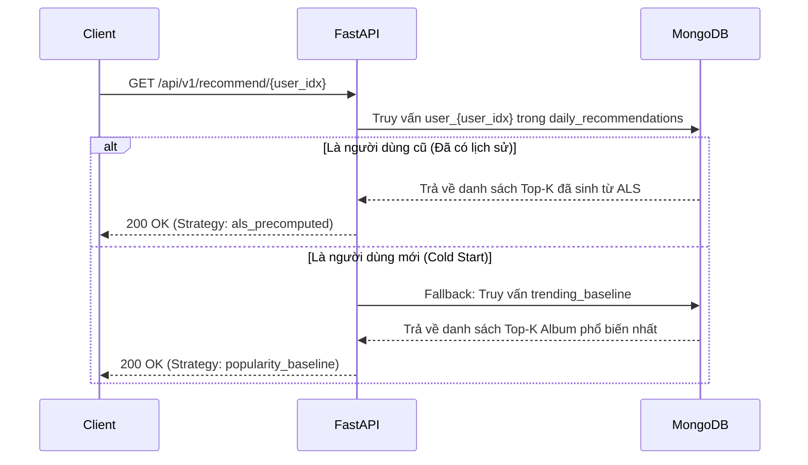

# Real-time Music Album Recommendation System (Kappa Architecture)

Dự án xây dựng một đường ống dữ liệu (Data Pipeline) theo thời gian thực phục vụ hệ thống gợi ý album nhạc. Hệ thống áp dụng Kiến trúc Kappa (Kappa Architecture) để xử lý toàn bộ dữ liệu dưới dạng luồng (stream-first design), kết hợp mô hình Lọc cộng tác (Collaborative Filtering) dựa trên phản hồi ẩn (Implicit Feedback) bằng thuật toán ALS.

## 1. Kiến trúc hệ thống

Hệ thống được thiết kế thành 4 tầng xử lý độc lập, tối ưu hóa cho Data Engineering:
1. **Data Ingestion:** Kafka Producer đọc dữ liệu tương tác thô theo từng dòng và đẩy vào message broker theo thời gian thực.
2. **Stream Processing & Storage:** Apache Spark Structured Streaming tiêu thụ luồng sự kiện từ Kafka và ghi liên tục vào MongoDB. Các metadata tĩnh được nạp bằng Batch Job.
3. **Machine Learning & Batch Inference:** Sử dụng thư viện `implicit` để huấn luyện mô hình Alternating Least Squares (ALS) trên ma trận thưa (Sparse Matrix). Sau đó, tiến trình Batch Inference sinh sẵn (pre-compute) Top-K gợi ý và lưu trở lại MongoDB nhằm đảm bảo độ trễ thấp.
4. **API Serving:** FastAPI cung cấp các endpoint truy xuất danh sách gợi ý. API không tự tính toán trực tiếp mà truy vấn kết quả từ MongoDB, mang lại tốc độ phản hồi cực nhanh (< 50ms).

<p align="center">
  
</p>

## 2. Ngăn xếp công nghệ (Tech Stack)

* **Message Broker:** Apache Kafka / Zookeeper
* **Stream Processing:** Apache Spark (Structured Streaming)
* **Machine Learning:** Thư viện `implicit` (ALS), `scipy.sparse`, `pandas`
* **Database / Data Storage:** MongoDB (Hot Storage), Parquet
* **Backend API:** FastAPI (Python 3.x), Uvicorn
* **Infrastructure:** Docker Compose

## 3. Cấu trúc thư mục

* `ingestion/`: Mã nguồn Kafka Producer giả lập luồng sự kiện từ file tương tác.
* `processing/`: Các job Spark Streaming xử lý dữ liệu động và Spark Batch xử lý metadata tĩnh.
* `ml/`: Chứa các kịch bản chuẩn bị dữ liệu (`prepare_data.py`), huấn luyện mô hình (`als.py`) và sinh danh sách gợi ý offline (`batch_inference.py`).
* `api/`: Dịch vụ web FastAPI phục vụ các endpoint gợi ý, lịch sử và trạng thái hệ thống.
* `data/`: Thư mục chứa tập dữ liệu thô đầu vào.
* `artifacts/`: Thư mục chứa các mô hình đã được huấn luyện (`als_model.npz`, `user_item_matrix.npz`).
* `docker-compose.yml`: Khởi tạo Kafka, Zookeeper, Spark và MongoDB.

## 4. Tập dữ liệu (Dataset)

Dự án sử dụng tập dữ liệu **LFM-1b Dataset**, bao gồm 3 tệp chính:
* `lfm1b-albums.inter`: Dữ liệu tương tác sự kiện (`user_id`, `albums_id`, `timestamp`, `num_repeat`).
* `lfm1b-albums.user`: Siêu dữ liệu nhân khẩu học và đặc trưng hành vi người dùng.
* `lfm1b-albums.item`: Siêu dữ liệu định danh album và nghệ sĩ.

## 5. Hướng dẫn khởi chạy

### Bước 1: Khởi động hệ sinh thái Big Data
Chạy các container (Kafka, Zookeeper, MongoDB, Spark) ở chế độ background:
```bash
docker-compose up -d
```

### Bước 2: Chạy Data Pipeline
1. **Ingestion:** Mở terminal, kích hoạt môi trường ảo Python và chạy Producer để bắn dữ liệu vào Kafka:
   ```bash
   python ingestion/main.py
   ```
2. **Processing:** Submit Spark Streaming Job để đọc từ Kafka và ghi vào MongoDB:
   ```bash
   spark-submit processing/spark_stream.py
   ```

### Bước 3: Huấn luyện Mô hình & Sinh gợi ý
Thực hiện lần lượt các script trong thư mục `ml/`:
1. Trích xuất dữ liệu từ MongoDB ra Parquet và lọc nhiễu:
   ```bash
   python ml/prepare_data.py
   ```
2. Huấn luyện mô hình ALS và lưu artifacts:
   ```bash
   python ml/als.py
   ```
3. Chạy Batch Inference để sinh sẵn kết quả và lưu vào MongoDB:
   ```bash
   # Thiết lập biến môi trường để tối ưu luồng tính toán (Windows PowerShell)
   $env:OPENBLAS_NUM_THREADS="1" 
   python ml/batch_inference.py
   ```

### Bước 4: Khởi chạy API
Khởi động máy chủ FastAPI:
```bash
python -m uvicorn api.main:app --reload
```
Truy cập giao diện tài liệu API (Swagger UI) tại trình duyệt: **`http://localhost:8000/docs`**

## 6. Luồng hoạt động của API (Serving Flow)

Khi một yêu cầu gợi ý được gửi đến hệ thống, API xử lý theo kịch bản cực kỳ tối ưu như sau:

